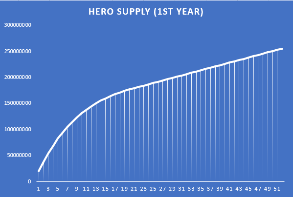

# Hero

$Hero token is the governance token of the FarmHero protocol.

$Hero token mints at a speed of 33.333 per second. The initial daily production rate is 2,880,000 $HERO per day.

The production speed will decrease by 10% every 7 days, for 21 times. After that, $Hero token will keep the speed. The first year will produce 255521677 $HERO token, after that, each year will produce 127,451,238 $HERO token.

## Deflationary Design via in-house Games

Both the auction game and the fomo game are designed to burn $HERO token continuously. It will ensure that $HERO price is supported and avoid the sell-off of normal yield farming protocols.

| Percentage | Usage |
| :--- | :--- |
| 30% | Reserved for Future NFT Farming |
| 30% | Vault Farming |
| 20% | Reserve for Ecosystem such as partnership and future incubation |
| 5% | Genesis NFT Farming |
| 10% | Team |
| 5% | Community Rewards such as bug bounty, marketing campaign, airdrops |

Right now, as we are at genesis yield farming, most of the tokens produced each day \(60% around\) are locked. Please check our website for the current circulating amount of HERO token. With the deflationary design the team expect the token supply would be stabled at 300 million - 400 million.

## Max Supply

There is a max supply of 500 million HERO$ tokens. When it reaches 500 million, $HERO won't mint. Tho this will change according to DAO vote by $HERO token holders.

